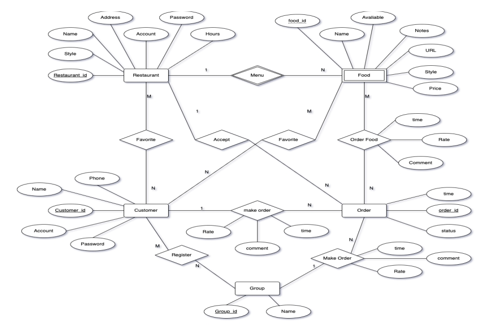
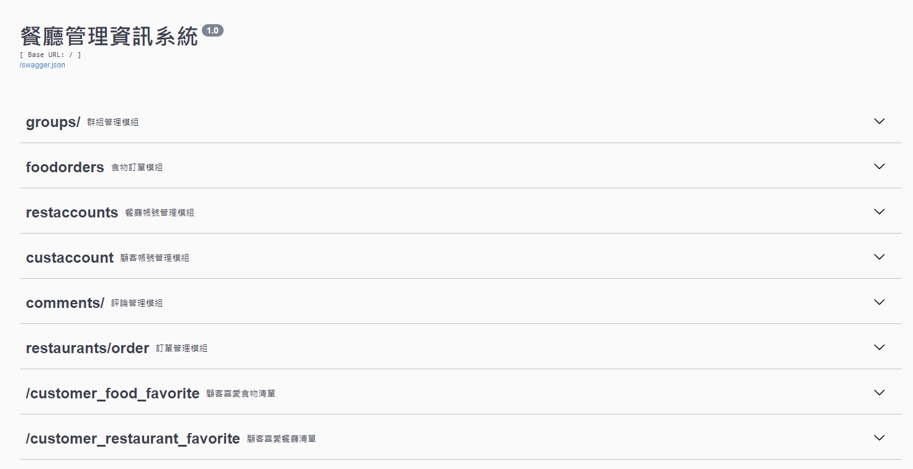
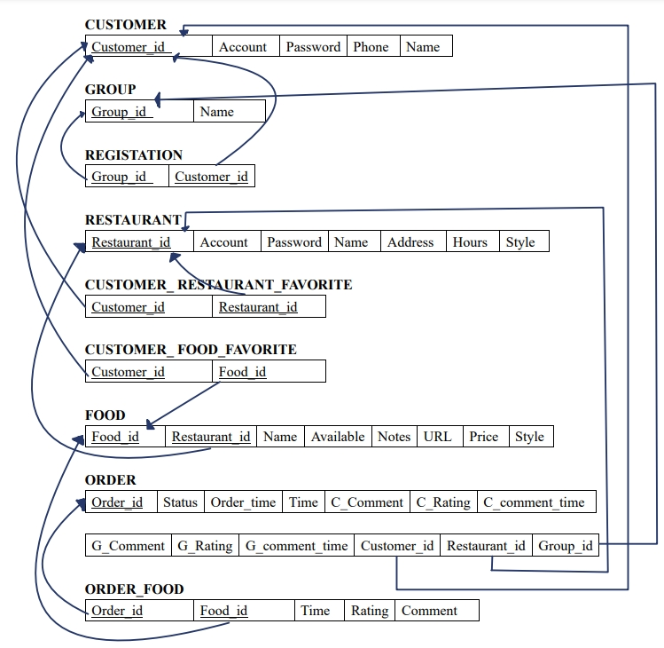

# Restaurant_Booking_System
A system to order food and leave comments for restaurants and tne food provided by these restaurants for 2023 NCCU DBMS
## Prerequisites
* python 3.8.8
* MySQL
## MySQL
* 建立 database:使用 MySQL Workbench 8.0 CE 後執行 RBS.sql
* 在 *./Backend/config.py.example*下修改 對應欄位後 將檔名改為 config.py
## Flask
* 進到 *./Backend* 下 `cd Backend` 
* 安裝套件 `pip install -r requirements.txt`
* 啟動 `python app.py`
* http://localhost:5000/

## Model

## RESTful API

# Relational Schema
